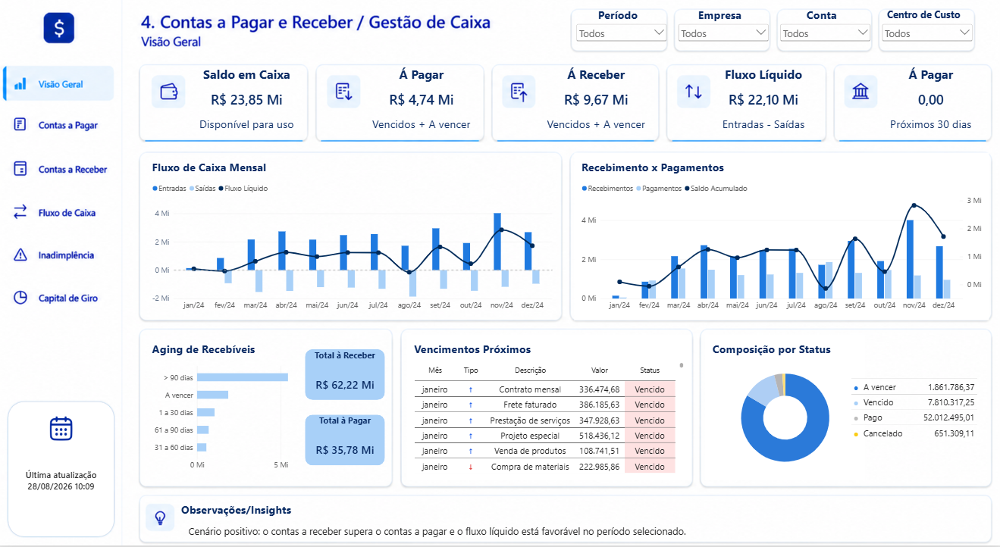
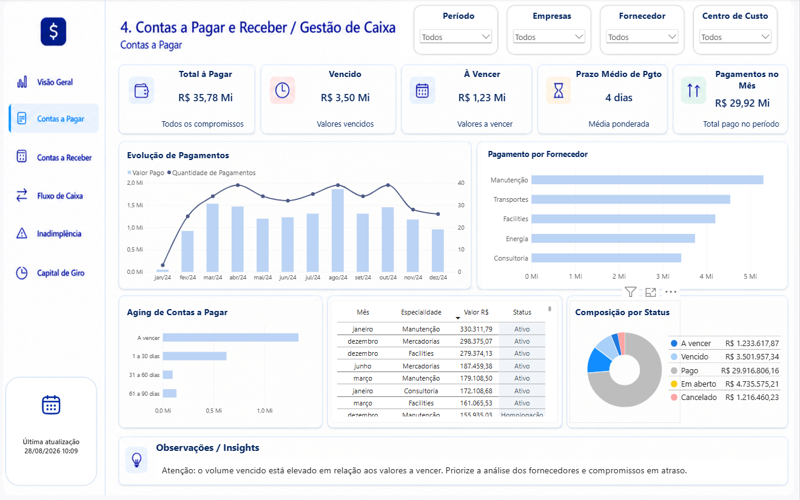
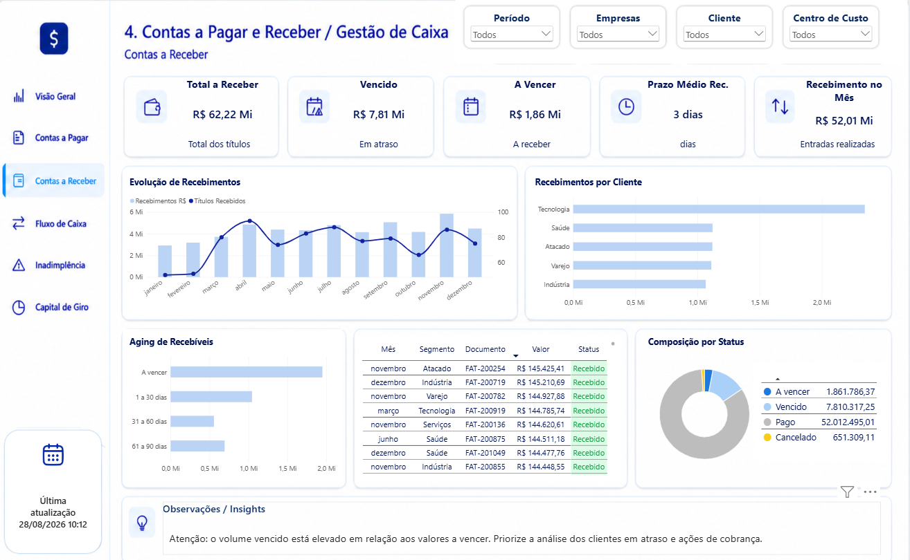
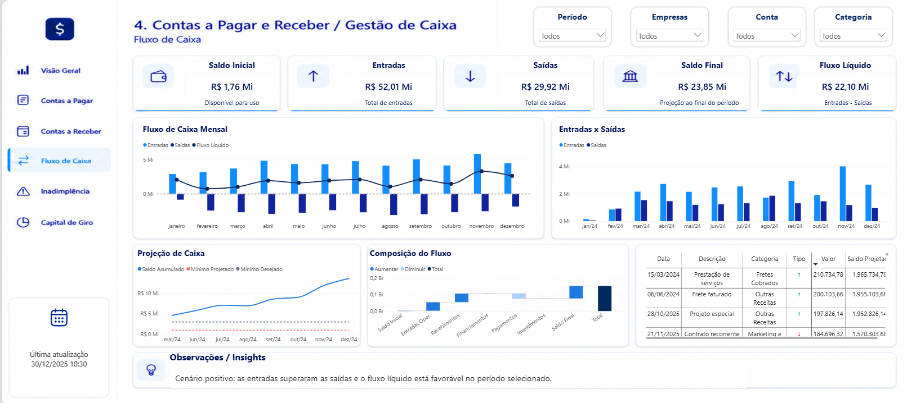
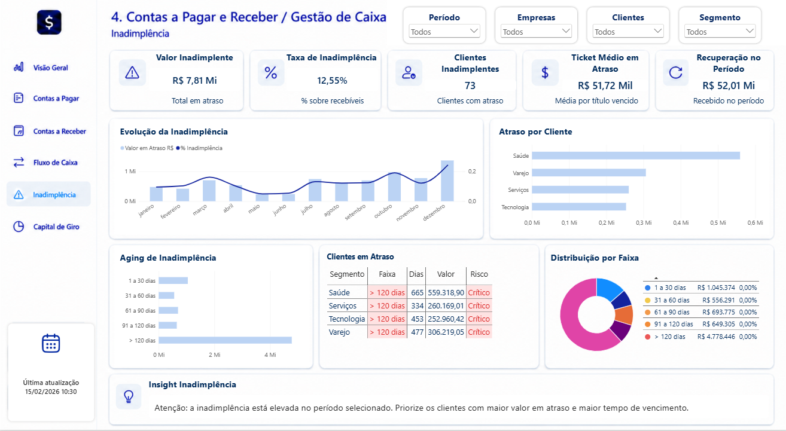
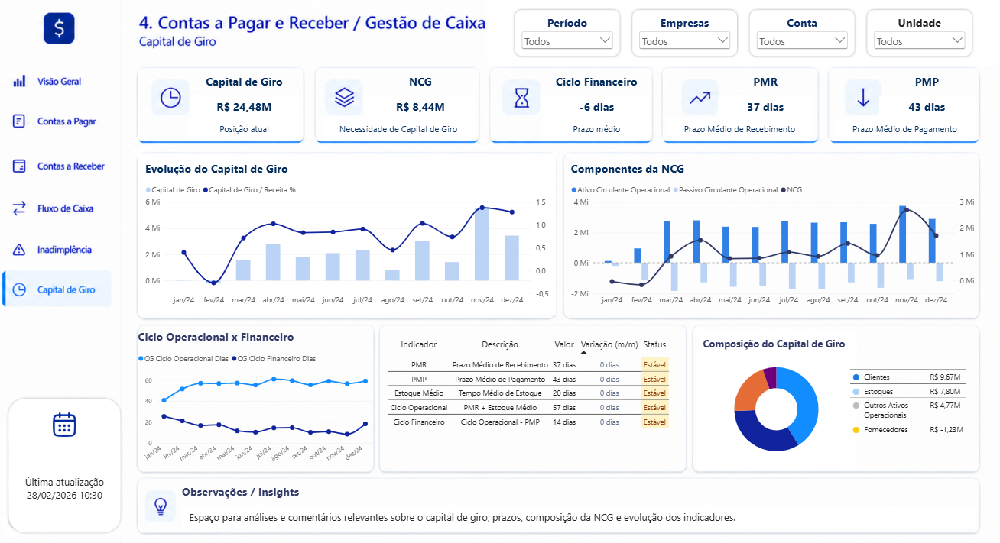

# Contas a Pagar e Receber / Gestão de Caixa


Dashboard financeiro desenvolvido em Power BI para apoiar a gestão de caixa empresarial. A solução reúne contas a pagar, contas a receber, fluxo de caixa, inadimplência e capital de giro em uma experiência analítica integrada.

## Objetivo

Transformar dados financeiros operacionais em uma visão gerencial clara, permitindo acompanhar liquidez, compromissos, recebimentos, atrasos e necessidades de capital de giro para apoiar decisões de curto prazo.

## Principais análises

- Saldo em caixa, entradas, saídas e fluxo líquido
- Contas pagas, recebidas, vencidas e a vencer
- Evolução mensal de pagamentos e recebimentos
- Aging de contas a pagar e de recebíveis
- Concentração por fornecedor, cliente e status
- Projeção e composição do fluxo de caixa
- Valor, taxa e aging da inadimplência
- Capital de giro, NCG, PMR, PMP e ciclo financeiro
- Filtros por período, empresa, conta, cliente, fornecedor, categoria e centro de custo

## Páginas do relatório

### Visão Geral

Resumo executivo da posição financeira, com saldo em caixa, valores a pagar e a receber, fluxo líquido, evolução mensal, próximos vencimentos e composição por status.



### Contas a Pagar

Acompanhamento de compromissos, vencimentos, pagamentos, prazo médio, aging e concentração por fornecedor.



### Contas a Receber

Análise de títulos, recebimentos, atrasos, prazo médio, aging e concentração por cliente.



### Fluxo de Caixa

Visão das entradas e saídas, fluxo líquido mensal, projeção de caixa, composição do fluxo e detalhamento dos movimentos.



### Inadimplência

Monitoramento de valores em atraso, taxa de inadimplência, clientes inadimplentes, aging e faixas de risco.



### Capital de Giro

Acompanhamento de capital de giro, necessidade de capital de giro, PMR, PMP, ciclos operacional e financeiro e composição dos recursos.



## Tecnologias e competências

- Power BI
- Power Query
- DAX
- Modelagem dimensional
- Visualização de dados financeiros
- Gestão de caixa e capital de giro
- Análise de contas a pagar e receber

## Estrutura do repositório

```text
power-bi-gestao-caixa/
├── 01-power-bi/
│   └── dashboard-gestao-caixa.pbix
├── 02-imagens/
│   ├── capa.png
│   ├── visao-geral.png
│   ├── contas-a-pagar.png
│   ├── contas-a-receber.png
│   ├── fluxo-de-caixa.png
│   ├── inadimplencia.png
│   └── capital-de-giro.png
├── 03-bases/
│   └── base-dados-gestao-caixa-powerbi.xlsx
└── README.md
```

## Dados demonstrativos

Este projeto foi desenvolvido para portfólio com dados sintéticos e demonstrativos. Os valores, empresas, clientes, fornecedores e demais registros não representam informações reais ou confidenciais.

## Autor

**Fauzer Vieira**  
Business Intelligence & Finanças

- [Portfólio](https://fauzervieira.github.io/)
- [GitHub](https://github.com/fauzervieira)
